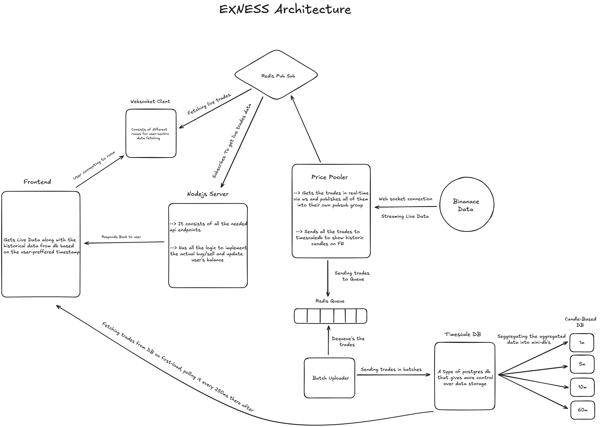

# Exness Trading Platform


A high-performance, real-time cryptocurrency trading platform built with modern web technologies. This platform features live price streaming, multiple timeframe candlestick charts, and support for both simple and leveraged trading positions.

## Architecture Overview

The platform consists of three main applications working together to provide a seamless trading experience:

### Price Pooler

- Connects to Binance WebSocket streams for real-time trade data (BTC, ETH, SOL)
- Implements batch processing with configurable batch size (500 trades) and interval (2 seconds)
- Processes trades through Redis queue for high-throughput data ingestion
- Generates real-time candlestick data for multiple timeframes (30s, 1m, 5m, 1h)
- Stores tick data in TimescaleDB for historical analysis
- Broadcasts live candle updates every 250ms via Redis pub/sub

### Backend Server

- Express.js server with Socket.IO for real-time WebSocket communication
- RESTful API endpoints for authentication, orders, and historical candle data
- Real-time trade and candle snapshot broadcasting to connected clients
- In-memory order management for both simple and leveraged positions
- User balance tracking and profit/loss calculations
- Support for up to 100x leverage trading

### Web Frontend

- Next.js 14 with TypeScript for type-safe development
- Real-time trading dashboard with live price updates
- Interactive candlestick charts with multiple timeframe support
- Instrument sidebar for quick asset switching
- Position management panel with P&L tracking
- Authentication system with protected routes
- Responsive UI built with shadcn/ui components and Tailwind CSS

## Technology Stack

### Backend

- **Express.js** - Web server framework
- **Socket.IO** - Real-time bidirectional communication
- **Redis** - Message broker and queue management
- **TimescaleDB** - Time-series database for trade and candle storage

### Frontend

- **Next.js 14** - React framework with App Router
- **React** - UI library
- **shadcn/ui** - High-quality UI component library
- **Tailwind CSS** - Utility-first CSS framework
- **WebSocket Client** - Real-time data streaming

## Project Structure

```
Exness-Trading/
├── apps/
│   ├── Pooler/              # Price data aggregation service
│   │   ├── db/              # Database connection and migrations
│   │   ├── ws/              # Binance WebSocket client
│   │   └── utils/           # Price conversion utilities
│   ├── server/              # Express API server
│   │   ├── routes/          # API endpoints (auth, candles, orders)
│   │   ├── services/        # Business logic
│   │   ├── types/           # TypeScript type definitions
│   │   └── db/              # Database queries
│   └── web/                 # Next.js frontend
│       ├── app/             # App router pages
│       ├── components/      # React components
│       ├── contexts/        # React context providers
│       └── hooks/           # Custom React hooks
└── packages/
    ├── ui/                  # Shared UI components
    ├── typescript-config/   # Shared TypeScript configurations
    └── eslint-config/       # Shared ESLint configurations
```

## Features

### Trading Capabilities

- Real-time price streaming from Binance
- Multiple cryptocurrency pairs (BTC/USDT, ETH/USDT, SOL/USDT)
- Support for both buy and sell positions
- Leveraged trading with up to 100x leverage
- Automatic P&L calculation
- Demo account with virtual balance

### Market Data

- Live trade data ingestion and processing
- Multiple timeframe candlestick charts (30 seconds, 1 minute, 5 minutes, 1 hour)
- Historical candle data via TimescaleDB continuous aggregates
- Real-time candle updates with 250ms refresh rate
- Bid-ask spread calculation with configurable percentage

### Data Management

- Batch processing for efficient database writes
- Redis queue for reliable message handling
- TimescaleDB hypertables for optimized time-series storage
- Continuous aggregate policies for automated data aggregation
- Integer-based price storage for precision (8 decimal places)

## Getting Started

### Prerequisites

- Node.js 20 or higher
- pnpm 10.4.1 or higher
- Redis server
- PostgreSQL with TimescaleDB extension

### Installation

1. Clone the repository:

```bash
git clone <repository-url>
cd Exness-Trading
```

2. Install dependencies:

```bash
pnpm install
```

3. Set up environment variables:
   Create `.env` files in each app directory with required configuration.

4. Initialize the database:
   Run the migration scripts in `apps/Pooler/db/migrations/`:

- `init.sql` - Creates the main candle table
- `aggregate.sql` - Sets up continuous aggregates

5. Start Redis server:

```bash
redis-server
```

### Running the Applications

```bash
#Start Binanace Stream to price pooler
cd apps/Pooler/binance
npx tsx index.ts

# Start the price pooler
cd apps/Pooler
npx tsx index.ts

# Start the backend server
cd apps/server
npx tsx index.ts

# Start the web frontend
cd apps/web
npm run dev
```

## API Endpoints

### Authentication

- `POST /api/auth/register` - User registration
- `POST /api/auth/signin` - User login

### Orders

- `POST /api/order/open` - Open a new position
- `POST /api/order/close` - Close an existing position
- `GET /api/order/active` - Get all active orders
- `GET /api/order/balance` - Get account balance

### Candles

- `GET /api/candles/:symbol/:timeframe` - Get historical candle data

## WebSocket Events

### Client Events

- `subscribe-candles` - Subscribe to candle updates for a symbol/timeframe
- `unsubscribe-candles` - Unsubscribe from candle updates
- `subscribe-trades` - Subscribe to live trade updates
- `unsubscribe-trades` - Unsubscribe from trade updates

### Server Events

- `candle-snapshot` - Real-time candle data update
- `live-trade` - Real-time trade execution data

## Performance Optimizations

- Batch processing of trades (500 per batch, 2-second intervals)
- Redis pub/sub for efficient message distribution
- TimescaleDB continuous aggregates for pre-computed candles
- Integer-based price storage for precision without floating-point errors
- WebSocket connection pooling with room-based subscriptions
- Optimized database indexes for time-series queries
